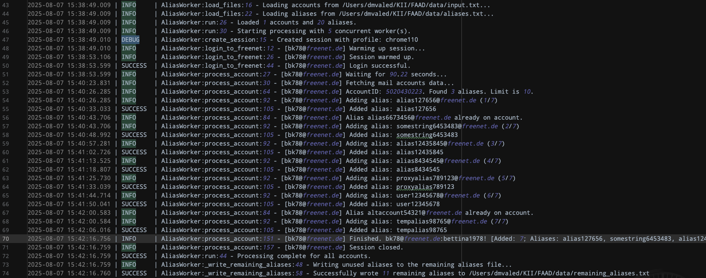
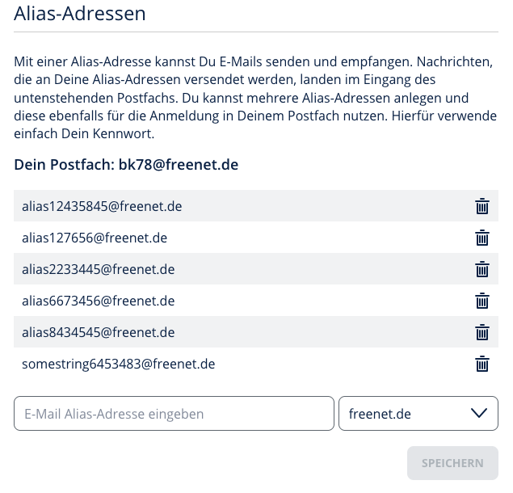

# Freenet Alias Adder


A robust and automated Python application designed to add multiple email aliases to Freenet.de accounts efficiently. The application handles login, session management, dynamic alias limits, and gracefully manages API rate limits.

---

## Key Features

*   **Automated Login:** Securely logs into Freenet.de accounts.
*   **Bulk Alias Addition:** Reads from a simple text file to add a list of aliases.
*   **Dynamic Limit Detection:** Automatically fetches the maximum number of aliases allowed per account and adds until the limit is reached.
*   **Graceful Rate-Limit Handling:** If a rate limit is hit, the application stops processing the current account, re-queues the unused alias, and saves all remaining aliases for a future run.
*   **Proxy Support:** Can route traffic through a SOCKS5 proxy for enhanced privacy.
*   **Structured & Maintainable:** The codebase is split into logical modules for easy maintenance and future development.
*   **Automated CI/CD:** A fully automated pipeline scans the code for security issues and builds a ready-to-use Windows executable for releases.

---

## For End-Users (Client Instructions)

If you just want to use the application, you do not need to install Python or deal with any code. Simply download the latest release package.

1.  **Download the Latest Release:**
    *   Go to the **[Releases](https://gitlab.com/YOUR_USERNAME/YOUR_REPO/-/releases)** page of this repository.
    *   Under the latest release version, download the `.zip` file (e.g., `FreenetAliasAdder-Windows-v1.0.zip`).

2.  **Unzip the File:**
    *   Extract the contents of the zip file to a folder on your computer. You will see a few files, including `FreenetAliasAdder.exe` and `start.bat`.

3.  **Prepare Your Data:**
    *   In the same folder, create a new sub-folder and name it **`data`**.
    *   Inside this `data` folder, create the following text files:
        *   `input.txt`: Each line should contain an account in the format `email:password`.
        *   `aliases.txt`: Each line should contain a single alias name (e.g., `mycoolalias123`).
        *   `proxy.txt`: (Optional) If you want to use a proxy, add it here in the format `ip:port:user:pass`. Otherwise, leave this file empty.

4.  **Run the Application:**
    *   Double-click the **`start.bat`** file.
    *   A command prompt will open and ask you to enter the path to your `data` folder. You can copy and paste the path from your file explorer.
    *   The script will then start processing your accounts.

---

## For Developers

These instructions are for setting up a local development environment to work on the source code.

### Prerequisites

*   [Python 3.8+](https://www.python.org/downloads/)
*   [Git](https://git-scm.com/downloads)

### Setup Instructions

1.  **Clone the Repository:**
    ```bash
    git clone https://gitlab.com/YOUR_USERNAME/YOUR_REPO.git
    cd freenet-alias-adder
    ```

2.  **Create the Environment File:**
    This project uses a `.env` file for credentials. Create a file named `.env` in the root of the project and add the following content:
    ```ini
    CLIENT_ID="customer_api"
    CLIENT_SECRET="rotOHeGC39FWOasymMLC4g=="
    ```

3.  **Create a Virtual Environment:**
    It's highly recommended to use a virtual environment to manage dependencies.
    ```bash
    # For Windows
    python -m venv venv
    call venv\Scripts\activate

    # For macOS/Linux
    python3 -m venv venv
    source venv/bin/activate
    ```

4.  **Install Dependencies:**
    All required packages are listed in `requirements.txt`.
    ```bash
    pip install -r requirements.txt
    ```

### Running the Script

Once the setup is complete, you can run the application directly from the source code:

```bash
python main.py
```

[]()

[]()

